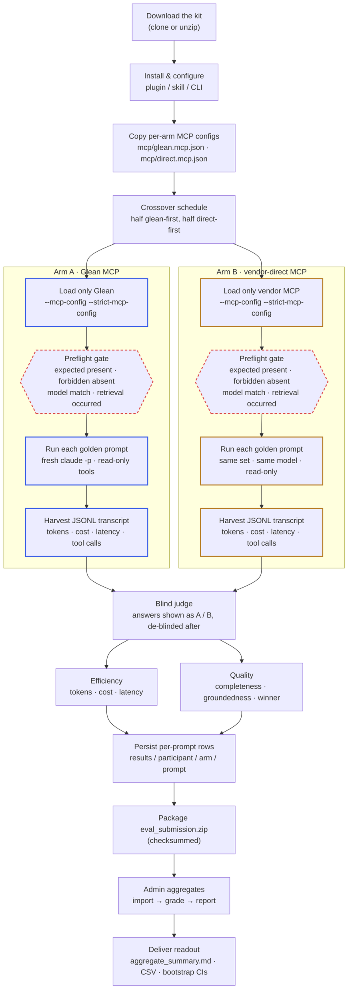

# Glean MCP A/B Eval Kit

Open-sourceable kit for running a defensible A/B evaluation of **Glean MCP** vs **vendor-direct MCP connectors** in Claude Code.

The kit is modeled after an enterprise crossover pilot pattern:

- **Arm A / Glean**: Claude Code with Glean MCP enabled.
- **Arm B / Direct**: Claude Code with the equivalent vendor MCPs enabled directly.
- Same model, same prompt set, same participant machine.
- Each prompt runs in a fresh Claude Code headless session.
- Usage is harvested from Claude Code's local JSONL transcripts, not estimated.
- Rows are auto-flagged for setup failures, model mismatch, and zero retrieval/tool calls.
- Results can be graded, aggregated, and packaged with checksums for central analysis.

> This repository does **not** ship customer-specific prompts or connector credentials. Customers provide their own MCP configs and golden prompt TSV.

## How it works



A printable, standalone version of this diagram is at [`docs/glean_mcp_ab_eval_flow.html`](docs/glean_mcp_ab_eval_flow.html) — open it in a browser (light/dark aware).

## Repository layout

```text
.claude-plugin/plugin.json       Claude Code plugin manifest
commands/                       Plugin slash-command prompts
.claude/skills/glean-mcp-eval/  Project skill alternative to plugin commands
scripts/glean_mcp_eval.py       Dependency-free Python CLI
bin/glean-mcp-eval              Shell wrapper for zip installs
config/eval.config.example.json Example customer config
config/mcp.glean.example.json   Per-arm MCP config template (Glean arm)
config/mcp.direct.example.json  Per-arm MCP config template (vendor-direct arm)
config/mcp.none.json            Empty MCP config used to isolate the judge
prompts/golden_prompts.example.tsv
                              Prompt TSV schema + safe sample prompts
docs/METHODOLOGY.md             Evaluation design and caveats
docs/CONNECTOR_HEALTH_CHECKLIST.md
                              Daily connector health process
docs/FIELD_RUNBOOK.md           Minimal field/customer runbook
docs/READOUT_TEMPLATE.md        Stakeholder readout template
docs/OPEN_SOURCE_NOTES.md       Sanitization checklist before publishing
docs/glean_mcp_ab_eval_flow.html
                              Standalone printable process-flow diagram
```

## Quick start

### 1. Install / enable the Claude Code plugin

From the repo root in Claude Code:

```text
/plugin install .
/reload-plugins
```

If distributing as a zip, unzip it and install from that local path.

### 2. Copy and customize config

```bash
cp config/eval.config.example.json eval.config.json
cp prompts/golden_prompts.example.tsv golden_prompts.tsv
mkdir -p mcp
cp config/mcp.glean.example.json  mcp/glean.mcp.json
cp config/mcp.direct.example.json mcp/direct.mcp.json
```

Edit `eval.config.json`:

- Set `prompts_file` and the `model` to hold constant.
- For each arm set `expected_mcp_servers`, `forbidden_mcp_servers`, and read-only
  `allowed_tools` / `disallowed_tools`.
- Optionally set `preflight_prompt`, `pricing_per_million`, `judge_hide_tokens`.

Fill in `mcp/glean.mcp.json` (your Glean MCP URL + token) and `mcp/direct.mcp.json`
(your vendor MCP). These live under `mcp/`, which is gitignored — they never ship.

#### Arm isolation (preferred)

Each arm sets `mcp_config` pointing to a JSON file that lists **only that arm's**
MCP servers. Runs then pass `--mcp-config <file> --strict-mcp-config`, so each arm
executes with exactly its own servers regardless of what is installed globally — **no
manual enabling/disabling between arms.** This is the recommended, defensible path and
removes the biggest source of human error.

Manual toggling (disable Glean, enable the vendor MCPs between arms) is only a
**fallback** for a Claude Code build without `--mcp-config`/`--strict-mcp-config`
(check with `doctor`).

Keep `allowed_tools`/`disallowed_tools` read-only: allow only `search`/`read`/`get*`
tools and deny writes and any arbitrary-dispatch tool (e.g. Glean's `run_tool`), so a
read-only eval can never mutate live systems.

### 3. Sanity check, then run preflight

First confirm the environment without spending tokens:

```bash
python3 scripts/glean_mcp_eval.py doctor --config eval.config.json
```

`doctor` reports whether `claude` is on PATH, **which CLI flags your Claude Code
version supports** (catches drift), the MCP servers it can see, and the prompt count.

Then validate each arm (add `--dry-run` to any command to print the exact `claude`
invocation without executing — useful for a customer security review):

```bash
python3 scripts/glean_mcp_eval.py preflight --config eval.config.json --arm glean --live
python3 scripts/glean_mcp_eval.py preflight --config eval.config.json --arm direct --live
```

For zip installs you can use the wrapper instead:

```bash
bin/glean-mcp-eval preflight --config eval.config.json --arm glean --live
```

Preflight checks static MCP config and, with `--live`, runs a harmless Claude Code probe that should call the configured retrieval tools.

### 4. Run an arm

Each prompt is run in an isolated `claude -p` session and stored under `results/<participant>/<arm>/<prompt_id>/`.

```bash
python3 scripts/glean_mcp_eval.py run \
  --config eval.config.json \
  --arm glean \
  --participant-id user01

python3 scripts/glean_mcp_eval.py run \
  --config eval.config.json \
  --arm direct \
  --participant-id user01
```

Use a crossover schedule: half the testers run `glean → direct`, half run `direct → glean`.

### 5. Grade, report, and package

```bash
python3 scripts/glean_mcp_eval.py grade --config eval.config.json --participant-id user01
python3 scripts/glean_mcp_eval.py report --config eval.config.json
python3 scripts/glean_mcp_eval.py package --config eval.config.json
```

For central analysis, participants send `results/eval_submission.zip`. The analysis owner imports each zip, then runs aggregate grading/reporting:

```bash
python3 scripts/glean_mcp_eval.py import --config eval.config.json /path/to/user01/eval_submission.zip
python3 scripts/glean_mcp_eval.py import --config eval.config.json /path/to/user02/eval_submission.zip
python3 scripts/glean_mcp_eval.py grade --config eval.config.json
python3 scripts/glean_mcp_eval.py report --config eval.config.json
python3 scripts/glean_mcp_eval.py package --config eval.config.json
```

Outputs:

- `results/aggregate_summary.md`
- `results/aggregate_rows.csv`
- `results/submission_manifest.json`
- `results/eval_submission.zip`

## Field runbook

For AE/AISM/AIOM/SA usage, start with [docs/FIELD_RUNBOOK.md](docs/FIELD_RUNBOOK.md).

## Plugin commands

After installing the plugin, use:

```text
/glean-mcp-eval:preflight
/glean-mcp-eval:run-arm
/glean-mcp-eval:grade-report-package
```

The slash commands guide Claude to invoke the local CLI with the right checks and prompts.

## Skill alternative

This repo also includes a project skill at `.claude/skills/glean-mcp-eval/SKILL.md`. In Claude Code, invoke it with:

```text
/glean-mcp-eval
```

Use the skill when you want a lightweight project-local workflow. Use the plugin when you want a versioned installable bundle with namespaced commands.

## What is measured

Per prompt / arm:

- input tokens
- output tokens
- cache creation/write tokens
- cache read tokens
- total tokens (plus a marginal input+output vs fixed cache-creation split)
- cost reported by Claude Code, and a configured list-price-equivalent cost
- wall-clock latency
- model(s) observed in transcript
- MCP tool calls by server
- retrieval-attempted flag
- final answer text
- optional judge scores: completeness, groundedness, usefulness, winner

## Validity gates

Rows are flagged or excluded when:

- expected MCP servers are missing
- forbidden MCP servers are configured in the wrong arm
- live preflight fails
- observed model differs across arms
- no MCP retrieval/tool call was observed
- `claude -p` returned an error

## Security / privacy

This kit records final answers and local transcript-derived metadata. Do not publish customer results. Before open sourcing this repo, verify that only generic sample prompts/configs are included.

## License

See [`LICENSE`](LICENSE).
